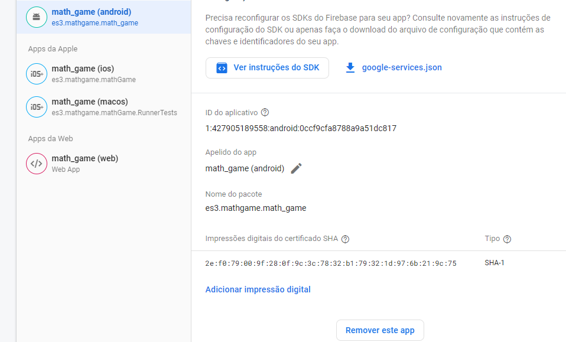

# math_game

## Oque você precisa fazer...

### 1 - Clonar o repositório

- Copie o link destacado;
- Acesse a pasta onde você quer colocar o projeto
- Dentro dela aperte com o botão direto e selecione **Abrir no terminal**
- no terminal insira essa linha `git clone https://github.com/bruno9800/math_game.git`

### 2 - Criar SHA-1

- Com o terminal ainda aberto acesse a pasta math_game/android ( `cd math_game/android`)
- insira a seguinte linha `./gradlew signingReport`
  
- copie o código SHA1
- Acesse o projeto math_game no firebase e vá até as configurações do projeto
  - **Engrenagem**: _canto superior esquerdo_
  - **Configurações do projeto**
  - Descer até '**Seus Aplicativos**'
  - **Adicionar impressão digital**
    

## docs

- [firestore](https://firebase.google.com/docs/firestore?hl=pt-br)
- [dart](https://dart.dev/guides)
- [chatGPT](https://chat.openai.com/)
